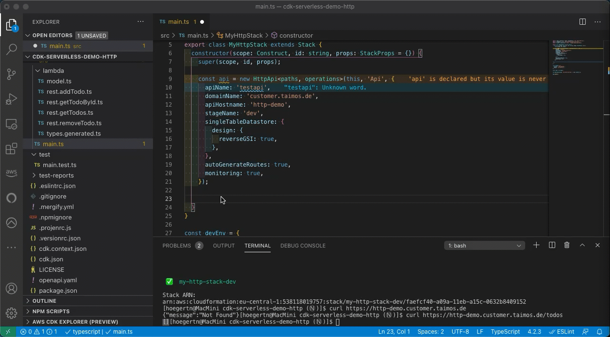

# CDK Serverless

[](https://badge.fury.io/js/cdk-serverless)

CDK Serverless is a tool suite to facilitate the use of the AWS Cloud Development Kit (CDK) in serverless architectures. It provides project management features to configure your TypeScript CDK app and also higher-level (L3) constructs for different APIs and resources needed for serverless applications. Additionally, it leverages utility libraries to write Lambda functions and do live updates to Lambda function code during development.

### Features

- Projen helper classes to configure certain use cases easily
- AWS CDK L3-construct for HttpApi and GraphQlApi
- Zero-config for Lambda functions and VTL templates
- Live update to Lambda function code using cdk-watch
- Automatic DynamoDB SingleTable infrastructure
- Automatic monitoring added for Lambda functions and APIs
- Full features of CDK usable to implement your special use cases
- Fully typed auto-completion for routes, resolvers, etc.

Short intro video: https://www.youtube.com/watch?v=GGc0eg3E9MM

## Quick Start

To start a new project we recommend using projen. To use CDK Serverless you can create any projen CDK Typescript app and then add the appropriate aspect provided by this toolkit.

```bash
$ npx projen new awscdk-app-ts
```

Adding CDK Serverless is a two step process:

1. Add 'cdk-serverless' as a dependency to your project
2. Run `npx projen` to install it

You can then add the 'GraphQlApiAspect' or the 'HttpApiAspect' depending on your desired API type.

`.projenrc.js`:
```ts
// Import cdk-serverless projen aspects
const { HttpApiAspect } = require('cdk-serverless/lib/projen');
const { AwsCdkTypeScriptApp } = require('projen');

const project = new AwsCdkTypeScriptApp({
  cdkVersion: '1.91.0',
  cdkVersionPinning: true,
  defaultReleaseBranch: 'main',
  name: 'cdk-serverless-demo',
  deps: [
    // Add cdk-serverless as dependency
    'cdk-serverless',
  ],
});

// Add HTTP API Support
new HttpApiAspect(project, {
  cdkWatch: {
    // Add live update scripts using CDK Watch
    dev: 'my-http-stack-dev/**',
  },
});

project.synth();
```

This will install all the necessary dependencies and register some scripts like `generate:api` to generate type definitions from the `openapi.yaml` and `live:dev` to watch for code changes and redeploy the Lambda function code.

Replace the content of file `openapi.yaml` with your OpenAPI definition and run `yarn generate:api` to generate type definitions. An [example OpenAPI file](https://github.com/taimos/cdk-serverless-demo-http/blob/main/openapi.yaml) is available in the [demo project](https://github.com/taimos/cdk-serverless-demo-http).

> **IMPORTANT! cdk-serverless needs an operationId field on every operation in the openapi.yaml**
>
> OpenAPI 3.0 or higher is supported in `openapi.yaml`. The content type for request- and response-body is currently limited to `application/json`.

After this you can add the selected L3 construct to your CDK app and configure it depending on your needs.

`src/main.js`:
```ts
import { HttpApi } from 'cdk-serverless/lib/constructs';
// Import the generated Path and Operation information
import { paths, operations } from './lambda/types.generated';

// Create a new HTTP API
const api = new HttpApi<paths, operations>(this, 'Api', {
  // Name of the API in the AWS console
  apiName: 'testapi',
  // This will be prefixed with 'api.' by default and will lead to https://api.taimos.de
  domainName: 'taimos.de',
  // Name of the stage in a multi-stage deployment
  stageName: 'dev',
  // Automatically create a DynamoDB table and configure a global secondary index
  // HashKey will be 'PK' and SortKey will be 'SK'
  singleTableDatastore: {
    design: {
      // Create an inverted GSI with 'SK' as HashKey and 'PK' as SortKey
      reverseGSI: true,
    },
  },
  // Add a Cognito user pool with two groups and a trigger to customize welcome e-mails
  authentication: {
    groups: {
      admin: 'Admins',
      moderators: 'Mods',
    },
    triggers: {
      customMessages: true,
    },
  },
  // automatically generate lambda functions for all routes in openapi.yaml (true by default)
  autoGenerateRoutes: true,
  // Create a CloudWatch Dashboard to monitor the API and all Lambda functions (true by default)
  monitoring: true,
});
```

On the first `cdk synth` this will automatically bootstrap all lambda code files that are not yet existing. If you want to modify Lambda function definitions you can access them by calling:

```ts
api.getFunctionForOperation('operationId').doSomething()
```

This operation id supports autocompletion using the generated type definitions.



## DynamoDB SingleTable

If enabled a [Single-Table Design](https://www.alexdebrie.com/posts/dynamodb-single-table/) DynamoDB table will be created.

### Permissions

All functions have read permissions, regardless of which operation they are bound to. Only functions bound to a `DELETE`, `POST`, `PUT` or `PATCH` operation will have write permissions.

## Docs Links

- [FAQ](FAQ.md)
- [Issues / Features](https://github.com/taimos/cdk-serverless/issues)
- [Roadmap](https://github.com/taimos/cdk-serverless/projects)

## Constructs

- [Projen](./src/projen)
- [CDK L3](./src/constructs)

### Tools

- [Lambda Toolbox](https://github.com/taimos/lambda-toolbox)
- [CDK Watch](https://github.com/teamplanes/cdk-watch)

## Contribute

### How to contribute to CDK Serverless

#### **Did you find a bug?**

* **Ensure the bug was not already reported** by searching on GitHub under [Issues](https://github.com/taimos/cdk-serverless/issues).

* If you're unable to find an open issue addressing the problem, [open a new one](https://github.com/taimos/cdk-serverless/issues/new). Be sure to include a **title and clear description**, as much relevant information as possible, and a **code sample** or an **executable test case** demonstrating the expected behavior that is not occurring.

#### **Did you write a patch that fixes a bug?**

* Open a new GitHub pull request with the patch.

* Ensure the PR description clearly describes the problem and solution. Include the relevant issue number if applicable.

#### **Did you fix whitespace, format code, or make a purely cosmetic patch?**

Changes that are cosmetic in nature and do not add anything substantial to the stability, functionality, or testability will normally not be accepted.

#### **Do you intend to add a new feature or change an existing one?**

* Suggest your change under [Issues](https://github.com/taimos/cdk-serverless/issues).

* Do not open a pull request on GitHub until you have collected positive feedback about the change.

#### **Do you want to contribute to the CDK Serverless documentation?**

* Just file a PR with your recommended changes

## Authors

Brought to you by [Taimos](https://taimos.de)
